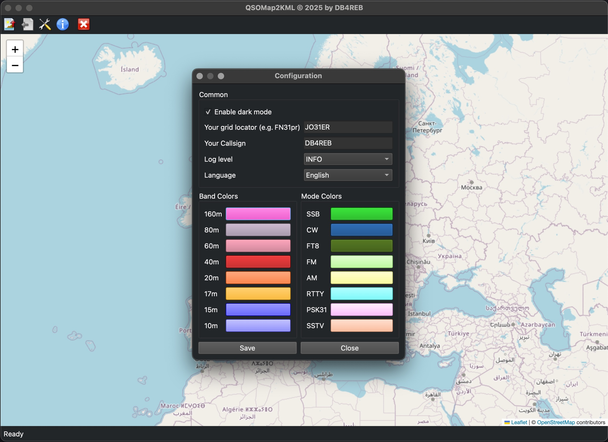

# QSOMap2KML

QSOMap2KML is a cross-platform application to visualize amateur radio QSOs from ADIF files on a map (Google Earth KML and interactive preview).  
It features a modern PyQt6 GUI, dark mode, band/mode color configuration, internationalization (i18n), and more.

## Features

- Import ADIF files and visualize QSOs as lines and pins in Google Earth (KML)
- Interactive map preview with colored markers and lines (Folium/Leaflet)
- Band and mode color configuration (fully customizable)
- Mouseover tooltips with QSO details (call, band, mode, name, date, time)
- Supports English and German (i18n)
- Asynchronous processing for large files
- Logging with rotating log files
- Color legend for bands and modes in both KML and map preview
- QTH (own location) marker and centering
- Configuration dialog for all settings

## Installation

Install the required dependencies:

```bash
pip install -r requirements.txt
```

## Usage

Start the application:

```bash
python main.py
```

## Configuration

Settings are stored in `config/settings.json`.  
You can configure language, dark mode, your grid locator, band/mode colors, and more via the configuration dialog in the app.

## File Formats

- **ADIF**: Standard amateur radio log format (`.adi`, `.adif`)
- **KML**: Google Earth format for map visualization

## Development

- Python 3.9+
- PyQt6 for GUI
- Folium for map preview
- KML export for Google Earth

## Logging

Log files are stored in the `logs/` directory with rotation.

---

## Screenshots

Below are example screenshots of QSOMap2KML:


*Application main window in dark mode.*


*Map preview with colored QSO markers, lines, and legend.*


*Configuration dialog for bands, modes, and user settings.*


*KML export visualized in Google Earth.*

---

## Contributions & Credits

- Free icon pack used from [small-icons.com](http://www.small-icons.com/packs/32x32-free-design-icons.htm)

---

## License

See [LICENSE](LICENSE).
